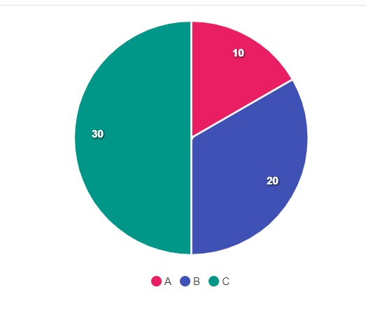

# Simple Apex Chart Pie

```html
<!DOCTYPE html>
<html lang="en">

<head>
  <meta charset="UTF-8">
  <meta name="viewport" content="width=device-width, initial-scale=1.0">
  <title>Document</title>
</head>

<body>
  <div id="chart"></div>

  <script src="https://cdn.jsdelivr.net/npm/apexcharts"></script>
  <script>
    var options = {
      chart: {
        type: 'pie',
        height: 350
      },
      labels: ['A', 'B', 'C'],
      series: [10, 20, 30],
      colors: ["#e91e63", "#3f51b5", "#009688"],
      legend: {
        show: true,
        position: "bottom",
      },
      tooltip: {
        y: {
          // override jika ingin tooltip nya data persen
          formatter: function (value, opt) {
            var total = opt.globals.series.reduce((acc, val) => acc + val, 0);
            var percentage = ((value / total) * 100).toFixed(1);
            return percentage.endsWith('.0') ? parseInt(percentage) + '%' : percentage + '%';
          }
        }
      },
      dataLabels: {
        enabled: true,
        // override jika ingin menampilkan data dan bukan persen
        formatter: function (val, opts) {
          return opts.w.config.series[opts.seriesIndex]
        },
      },
    };

    var chart = new ApexCharts(document.querySelector("#chart"), options);
    chart.render();

  </script>
</body>

</html>
```

Hasil:

